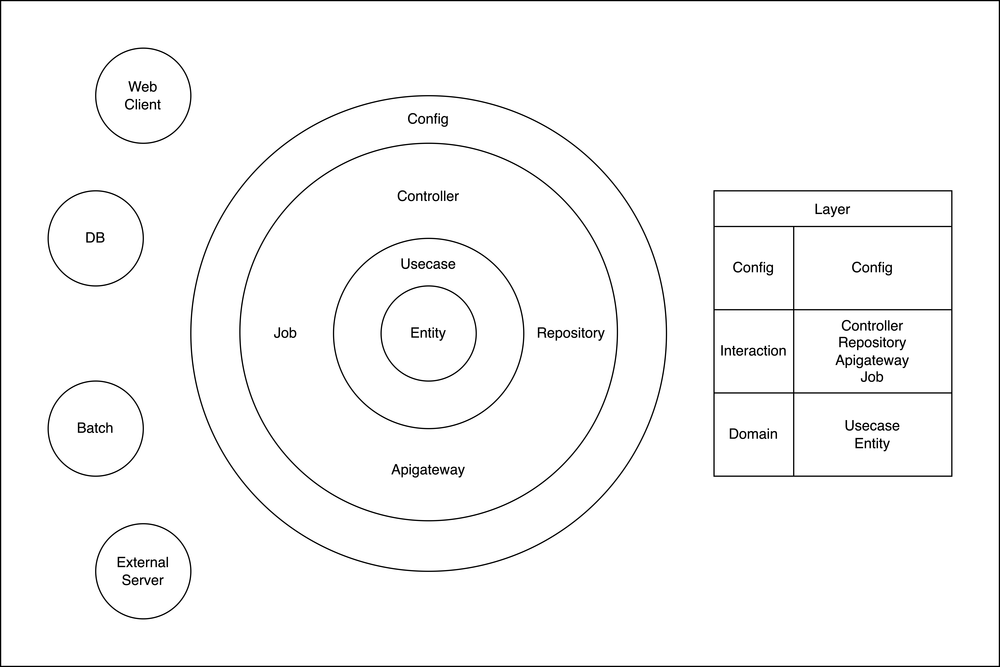

# AimHigh

- 고객이 신뢰할 수 있는 사업자 송금 서비스를 제공하겠습니다.
- 개발 디자인 문서 : [사업자 송금 API 개발](resources/README.md)

***

## 1. Develop Period
2024-04-03 ~ 2024-04-08

## 2. Contributor
@ChiefNavigator

## 3. Function
- 사업자 송금 API : 타 사업자에게 금액을 입금 받고, 이를 다른 사업자에게 송금

## 4. How to test
- [AimHighOpenApiTransactionApplication.java](aimhigh-openapi-transaction/src/main/java/com/lego/aimhigh/openapi/transaction/AimHighOpenApiTransactionApplication.java) 실행
- [AimHighChannelApplication.java](aimhigh-channel/src/main/java/com/lego/aimhigh/channel/AimHighChannelApplication.java) 실행
- [BizRemitRequestAdminController.http](https/BizRemitRequestAdminController.http) 를 통해 순차적으로 테스트

## 5. Environment
- IDE : IntelliJ IDEA 2023.1.5
- JAVA : Java 17
- JDK : Amazon Corretto version 19.0.2
- Framework
  - SpringBoot 3.2.4
  - Spock 2.3-groovy-3.0
  - Redis 7.2.4

## 6. Software Architecture
- CleanArchitecture

