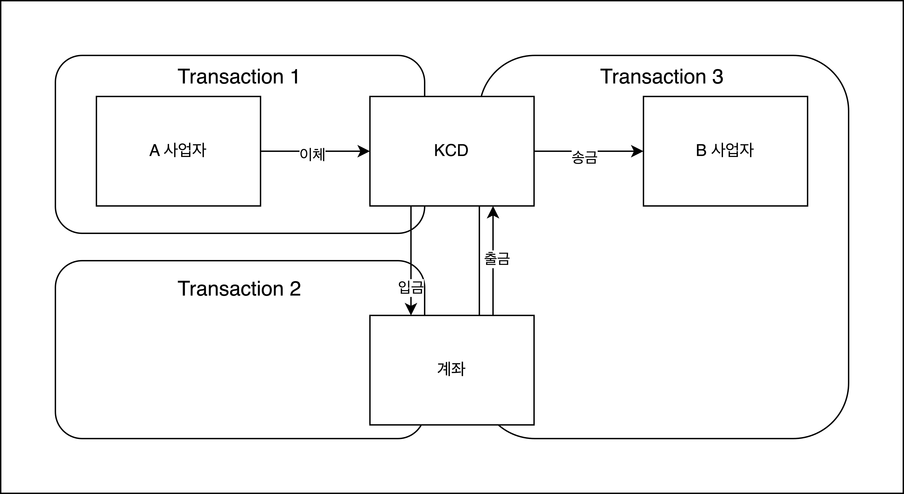

# Project Design

## 1. 프로젝트 목표
- 타 사업자에게 금액을 입금 받고, 이를 다른 사업자에게 송금하는 기능 구현

## 2. 요구사항 분석
- 기획서 : 뱅킹 서버 프로젝트_ver1.1pdf
- 실패 지점 분석
  - A 사업자로부터 이체 실패하는 경우
  - KCD 계좌에 입금이 실패하는 경우 
  - KCD 계좌에 출금이 실패하는 경우 
  - B 사업자에게 송금 실패하는 경우
- 논리적 트랜잭션 구성
  - 트랜잭션 묶음 기준 : 처리 과정에서 로직이 하나라도 실패했을 때, 비즈니스에 즉각적으로 문제가 발생하는 경우
  - Transaction 1 : Open API 를 통해 사업자 은행 계좌에서 KCD 은행 계좌로 이체하기 위한 트랜잭션 
  - Transaction 2 : 외부로부터 이체받은 내역을 KCD 계좌로 입금하기 위한 트랜잭션
  - Transcation 3 : KCD 계좌에서 출금하고 이를 다른 사업자 은행 계좌에 송금하기 위한 트랜잭션

- 동시성 제어
    - 계좌 데이터에 동시에 접근할 수 있는 환경
    - 갱실 유실 같은 데이터 정합성 문제를 방지하기 위해 계좌 데이터에 동시성 제어가 필요

## 3. 사업자 송금 로직 설계

### 3.1 사업자 송금 처리
#### 3.1.1 서비스 흐름

#### 3.1.2 서비스 로직
1. 사업자 송금 API
   1. 사업자 요청 생성 송금 API
      - 사업자 요청 생성을 3번 이상 실패하면 더이상 요청할 수 없으며, 관리자가 수동 처리
   2. KCD 은행 계좌 입금 API
   3. KCD 은행 계좌 출금 API

> 실패 회복 전략
> - 사업자 송금 과정에서 실패할 시, 유저는 사업자 송금 API를 다시 호출하여 실패지점부터 송금 시도 한다.  
> - 이를 위해 API는 멱등성을 가지고 설계한다.
> - 사업자 송금 최대 시도 횟수는 3회이며, 3회가 넘어갈 시 관리자가 수동으로 처리해줘야 한다.

## 4. 테이블 구성
- Users : 유저 정보가 저장된 테이블
- KcdBankAccounts : KCD 계좌 잔고가 저장된 테이블
- KcdBankAccountRecords : KCD 계좌 입출금 내역이 저장된 테이블
- BizRemittanceRequests : 사업자 송금 요청이 저장된 테이블
- BizRemittanceRequestRecords : 사업자 송금 요청 처리 내역이 저장된 테이블

## 5. 검증 및 배포 계획

## 5. 일정 계획 (2024-04-03 ~ 2024-04-08)

- [x] 2024-04-03 ~ 2024-04-04 : 프로젝트 디자인 및 개발 환경 구성 
- [X] 2024-04-04 ~ 2024-04-05 : 사업자 송금 요청 생성 API 개발
- [X] 2024-04-06 ~ 2024-04-06 : KCD 은행 계좌 입금 API 개발
- [x] 2024-04-07 ~ 2024-04-07 : KCD 은행 계좌 출금 API 개발
- [x] 2024-04-08 ~ 2024-04-08 : 검증 및 버그 수정