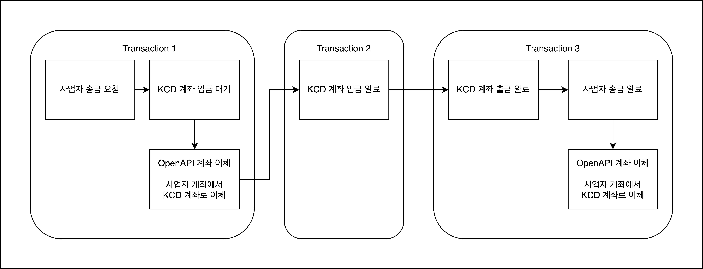

# Project Design

## 1. 프로젝트 목표
- 타 사업자에게 금액을 입금 받고, 이를 다른 사업자에게 송금하는 기능 구현

## 2. 요구사항 분석
- 기획서 : 뱅킹 서버 프로젝트_ver1.1pdf
- 실패 지점 분석
  - A 사업자로부터 이체 실패하는 경우
  - KCD 계좌에 입금이 실패하는 경우 
  - KCD 계좌에 출금이 실패하는 경우 
  - B 사업자에게 송금 실패하는 경우
- 논리적 트랜잭션 구성
  - 트랜잭션 묶음 기준 : 처리 과정에서 로직이 하나라도 실패했을 때, 비즈니스에 즉각적으로 문제가 발생하는 경우
  - Transaction 1 : 외부로부터 이체받은 내역을 KCD 계좌로 안정적으로 입금하기 위한 트랜잭션 
  - Transcation 2 : KCD 계좌에서 출금하고 이를 타 사업자에게 안정적으로 송금하기 위한 트랜잭션

- 동시성 제어
    - 계좌 데이터에 동시에 접근할 수 있는 환경
    - 갱실 유실 같은 데이터 정합성 문제를 방지하기 위해 계좌 데이터에 동시성 제어가 필요

## 3. 사업자 송금 로직 설계

### 3.1 사업자 송금 처리
#### 3.1.1 서비스 흐름

#### 3.1.2 서비스 로직
1. 클라이언트 사업자 송금 요청
2. 사업자 송금 API
   1. 사업자로 부터 KCD 계좌 이체
      > 1. 사업자 송금 요청 테이블에 송금 요청 생성하여 고유 번호 부여
      > 2. 사업자 송금 처리 내역 테이블에 송금 요청 상태 저장
      > 3. Open API 를 통해 사업자 계좌에서 KCD 계좌 이체
      >   - Success Callback : 사업자 송금 처리 내역 테이블에 요청 상태를 KCD 계좌 입금 대기 상태로 변경
   2. 이체 받은 금액 KCD 계좌 입금
      - 10초 간격 최대 3회 트랜잭션 실패할 경우, KCD 계좌 입금 실패 내역 저장
      > 1. KCD 계좌 테이블에 입금 금액 업데이트
      > 2. KCD 계좌 입출금 내역 테이블에 입금 내역 저장
      > 3. 사업자 송금 처리 상태 테이블에 KCD 계좌 입금 완료 상태 변경
      > 4. 사업자 송금 이벤트 발행
      >    - 10 초 간격 최대 3회 발행 시도 초과하면, 사업자 송금 데드 레터 발행
3. 사업자 송금 이벤트 Kafka
   - 발생된 사업자 송금 이벤트를 수신하여 사업자 이체 API 측에 사업자 송금 요청
     - 10 초 간격 최대 3회 수신 시도 실패하면, 사업자 송금 데드 레터 발행
   - 사업자 송금 데드 레터는 KCD 계좌 출금 실패 내역에 저장
4. 사업자 이체 API
   - 10초 찬격 최대 3회 트랜잭션 실패할 경우, KCD 계좌 입금 실패 내역 저장
   - 동일한 사업자 송금 요청은 같은 결과를 가지도록 API 멱등성 확보
   > 1. KCD 계좌 테이블에 출금 금액 업데이트
   > 2. KCD 계좌 입출금 내역 테이블에 출금 내역 저장
   > 3. 사업자 송금 처리 내역 테이블에 KCD 계좌 출금 완료 상태 변경
   > 4. Open API 를 통해 KCD 계좌에서 사업자 계좌로 송금
   >    - Success Callback : 사업자 송금 처리 내역 테이블에 사업자 송금 상태 완료 변경, 사업자 송금 요청 테이블에 송금 완료 상태 변경

### 3.2 사업자 송금 실패 처리
- 실패 내역 재시도 배치
  - 각 단계에서 실패한 내역 테이블을 기반으로 재시도한다.
  - 재시도 횟수는 최대 3회 이다.
  > - KCD 계좌 입금 실패 처리 배치
  > - KCD 계좌 출금 실패 처리 배치
  > - 사업자 송금 실패 처리 배치
- 사업자 송금 요청 모니터링 배치
  - 10분 이상 처리 되지 않은 사업자 송금 요청을 감지하여 모니터링 채널에 알람을 송신한다.

## 4. 테이블 구성
- Users : 유저 정보가 저장된 테이블
- KcdBankAccounts : KCD 계좌 잔고가 저장된 테이블
- KcdBankAccountRecords : KCD 계좌 입출금 내역이 저장된 테이블
- BizRemittanceRequests : 사업자 송금 요청이 저장된 테이블
- BizRemittanceRequestRecords : 사업자 송금 요청 처리 내역이 저장된 테이블
- KcdBankAccountDepositFailures : KCD 계좌 입금 실패 내역이 저장된 테이블 
- KcdBankAccountWithdrawalFailures : KCD 계좌 출금 실패 내역이 저장된 테이블
- BizRemittanceRequestFailures : 사업자 송금 실패 내역이 저장된 테이블

## 5. 검증 및 배포 계획

## 5. 일정 계획 (2024-04-03 ~ 2024-04-06)

- [x] 2024-04-03 ~ 2024-04-04 : 프로젝트 디자인 및 개발 환경 구성 
- [ ] 2024-04-04 ~ 2024-04-05 : 송금 API 개발
- [ ] 2024-04-05 ~ 2024-04-05 : 송금 실패 처리 배치 개발
- [ ] 2024-04-06 ~ 2024-04-06 : 검증 및 버그 수정